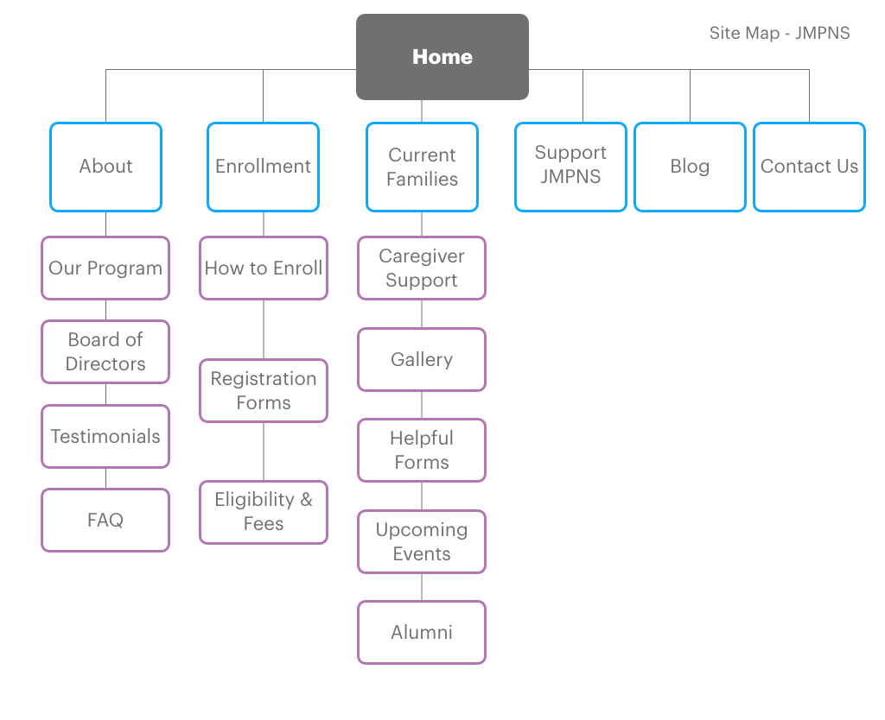
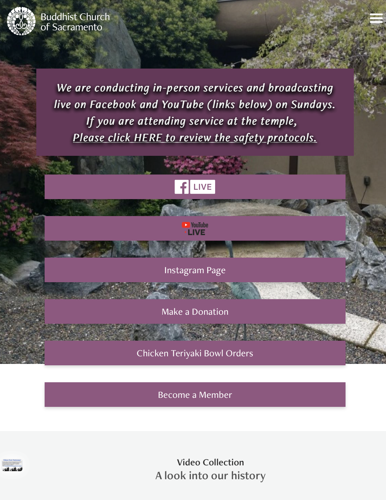
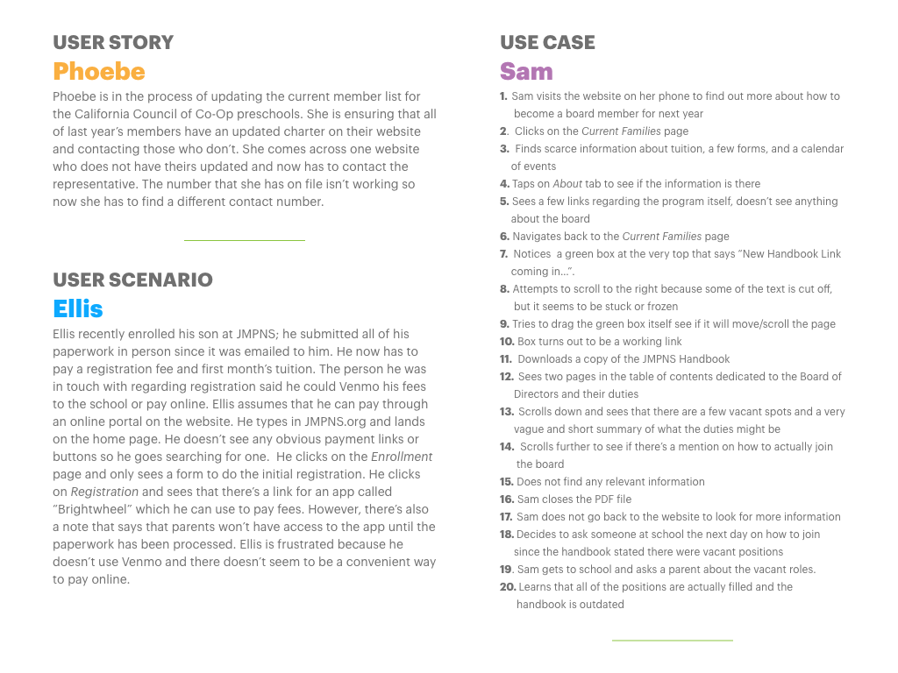

## Overview

JMPNS is a parent participation preschool located in West Sacramento. Under the leadership of Mrs. Hinton, director and teacher, the parents work together to take care of and run the school. Parents rely on the website to stay up to date on events, download required forms, refresh their memories on the procedures, and more. Prospective parents scour the site for as much information as possible to figure out if they would like to enroll their child in the school.

### Values

> “…a place for learning, playing, and growing - for the entire family.”  
> <www.jmpns.org>

“As we believe that parents are the child’s first and most important teachers, James Marshall provides an opportunity for parents and formal teachers to come together to guide a child’s early learning experience. It has proven to be a place where both parents and children can learn about themselves and others in an environment designed for growth and exploration.”

### Target Audience

Parents or caregivers of children between the ages of 2yrs/9mos and 5 years old that live in the Sacramento area. Both current and prospective families.  
What they care about:  
• their children  
• quality education for their children  
• peace of mind

### Tone and Image

#### • CHILDLIKE WONDER • FUN • PLAYFUL • COMMUNITY

### Problems

The typeface, colors, and content all do their jobs in conveying what the website is all about. However, it's easy to get lost trying to find a certain piece of information and some parts may be harder to read. Most of the content seems to be lumped under the “About” tab, which makes sense but perhaps “Tuition and Fees” could go under “Enrollment”.

Other things to consider:  
• The website is dense and packed full of information (we do want all the information though).  
• Not very mobile-friendly.  
• Broken links, links go to wrong pages.  
• The footer text is hard to read (not very accessible).

### Proposal

A website that is uncluttered and easy to navigate is needed. We will optimize the mobile version of the site with the goal of improving the overall responsiveness. We will re-organize information architecture and improve the layout to make current content easier to find and easier to read.

Additional features to add:  
• a page dedicated to a blog  
• more information about the board of directors  
• a history section for alumni  
• an events calendar

Specific visual goals:  
• uncluttered  
• modern  
• colorful (using JMPNS logo colors)

## Information Architecture

### Content Inventory

Content Inventory chart created in Numbers.

### Card Sort

Sticky notes are really good for this sort of thing.

### Site Map

Finally — a nice, clean, and organized page.

---;

## Competitors

### Woodland Parent Nursery School  

[https://woodlandparentnurseryschool.org](https://woodlandparentnurseryschool.org)

My first thought was wow, I love their logo and I love their font choice and I love how the website looks. Their website definitely has a cleaner and more modern feel than the current JMPNS site. Their cover/header is a clear call-to-action to "Join our Co-op".

However, while exploring and checking out some of their other pages, it's not that much better than the JMPNS site. Some of the text, like in the "Thoughts from the Teacher" page can be broken up more or set up in a blog page. The "Apply now" button opens up a new tab to downloadable PDF files. The "Learn More" button next to the navigation is redundant because it leads to the same enrollment page. Overall, I really like the look and feel of their site but they could use a better IA or more planning for the content.

### Sacramento Montessori School  

[https://www.montessorisacramento.com](https://www.montessorisacramento.com)

The look and feel is giving me corporate vibes but their information is all really well-organized and easy to page through. I do wish that there wasn't so much scrolling to do on the main page just to get to the bottom. I like that they included detailed information about each of their programs, including information about toilet-training. I think that their product might be better but that red "Request Enrollment Now" button might be a bit of an overkill.

### Tiny Tot Time  

[http://www.landparktinytots.com](http://www.landparktinytots.com)

Why does that Comic Sans looking font have to BE everywhere? JMPNS is using a similar one called Patrick Hand, and on one hand - I get it. On the other one, I want to do more research and see if there's an alternative that is also friendly, playful, and easily-readable.

I appreciate that there are **less** pages to look through and there doesn't seem to be any filler text or content. Everything is short and to the point. The "Class Overview" page does need a sort of revamp with less columns or maybe a tiled gallery or slideshow for those little bits of information.

---;

## Role Models

### Buddhist Church of Sacramento  

[https://www.buddhistchurch.org](https://www.buddhistchurch.org)

  

Pretty responsive and they have a lot of information that's organized well in a small size. The more important links—the ones they want us to see first—are in purple, and as we scroll down we see other links to other sections of the site.  
I don't know what's up with that little picture at the corner though.

### Language Academy of Sacramento  

[https://www.lasac.info](https://www.lasac.info)

  

The Language Academy is a charter school part of the Sacramento Unified School District and they have a lot more going on in terms of content and pages. I find it easier to navigate than other sites with less content and perhaps it's because most of the information that I'm looking for is more intuitive. Or perhaps it's because the most visited links might be front-and-center, right in the nav bar.

### Woodland Parent Nursery School (as inspiration)

[https://woodlandparentnurseryschool.org](https://woodlandparentnurseryschool.org)

Although I placed this site in the competitors section and even critiqued them for a few things, I really feel like I could take some of the things that they did and apply it to the JMPNS site.

Their site overall seems less cluttered but has a soothing effect—maybe it's the gray tones? Or the cute cloud shapes sprinkled throughout? The navigation also seems clear. I also like how they titled some of their pages, like "Meet the Teachers" and "Meet the Board". The copy seems more friendly and less intimidating as opposed to going with "About The Board of Directors".

---;

## Personas

  
  

Empathizing with users is the first and foremost principle of designing for user experience. If you can't put yourself in their shoes, then you can't design for them. This was very much a creative thinking exercise and trying to figure out the motivations behind each person who might visit the JMPNS site. These are fictional users, and ideally, these personas would be based on facts and data gathered through user research. In this case, I had my own experience as a JMPNS parent and talking to other JMPNS parents.

---;

## Scenarios

The purpose of these scenarios was to imagine being a user navigating through the site and trying to find information or complete a task. Thinking through a problem is a big part of being able to solve those problem and eventually articulate design decisions. It is important to reason through a problem, bring it back from abstraction, and then defend why you came to certain conclusions.

---;

## Design Process Highlights

### Hierarchy List

1. Tuition
2. Class Times  
3. Eligibility  
4. About the Program  
5. Testimonials / Reviews  
6. Where to pay  
7. Important Docs  
8. Events  
9. Contact  
10. Handbook

Rating the pages of the JMPNS site, most to least "important." All pages are important, but this list reflects which users would visit which pages first. This list helped organize website content and was created after developing user personas and scenarios.

---

### Brainstorming with Coggle

This brainstorming mind map helped shape the overall design and information architecture. It visually organized ideas and connections for the redesign.
