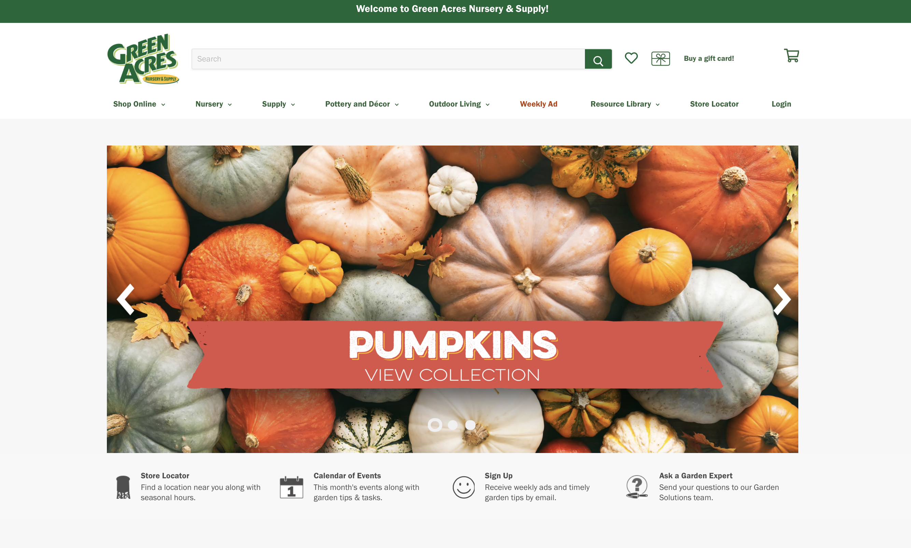
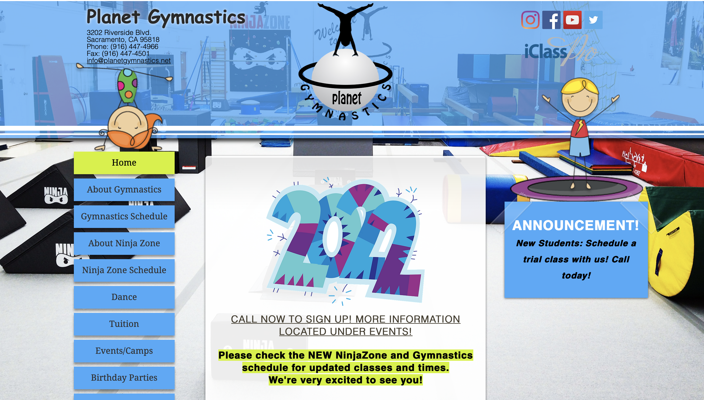
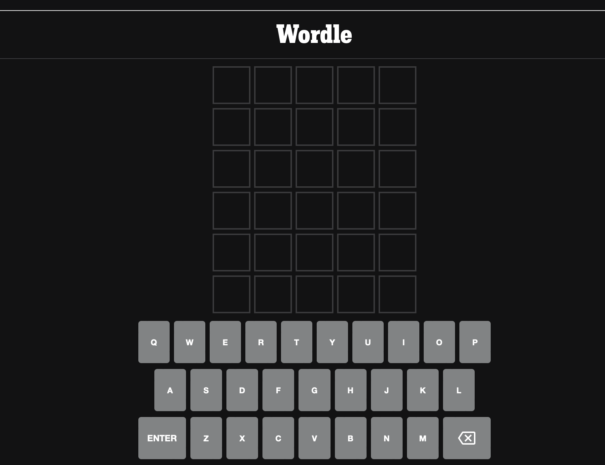

## Reviewing Local Websites

A short critique on the user experience and user interface of websites of local businesses in the Sacramento area

### GOOD: [Green Acres Nursery & Supply](https://idiggreenacres.com/)

A clean website, organized, no weird typos, and easy to navigate. I can choose to browse through their menu and categories or simply use the search bar. Anything I might need is conveniently located at the very top in the nav bar, from the shopping cart to a store locator, and even a resource center. Scrolling down is also a great experience because they display a lot of pretty pictures. I really like that the plants are also well-organized within the Nursery dropdown menu.  

"I dig" their site!

* * *

## BAD: [Dad’s Kitchen](https://ilovedadskitchen.com/)

I’ve had a problem with the Dad’s Kitchen website for a while now. My biggest pet peeve is that if I want to look at the menu, it downloads a PDF to my phone every single time. Not only does it take a little longer to load than if it were just posted on the web site, but it takes up storage on my phone and it’s an annoying experience to have to go back in every time to delete the menu.
Looking at the site from my desktop, it looks alright. It’s not ugly and it provides pictures of their delicious-looking food. As you scroll down, you see their current schedule (well it’s their summer schedule so not that current) and some events happening. I wondered too if a PDF would download if I were to click on “Eats” on the main page (_not_ the header) so I click on it and it’s a blank anchor link (<https://ilovedadskitchen.com/#>) so it doesn’t go anywhere. If I click on “Eats” or even “Locations” in the header, it does take me to a different page where I can access the menu. Yes, the menu is a PDF but it opens up on my browser. So, the pdf download thing must be either a personal problem or a mobile accessibility issue.  

When clicking on the social media links in the header, I’m taken to the Dad’s Land Park IG, Facebook, and Twitter. Is there separate social media accounts for Dad’s in Fair Oaks, since that location is also prominent on the main site?  
Although it looks alright at first glance, my opinion is that it’s easy to get lost trying to find certain information on this website. My wish list for this website is a page dedicated to the menu, more organized IA, and updated content.

* * *

## UGLY: [Planet Gymnastics](https://www.planetgymnastics.net/)

On one hand, I get it. The bright blue and greens are supposed to capture a childlike sense throughout the site, since the gymnastics offerings are aimed at kids but they could have been used in a different way. The transparent header and footer don’t mesh well with the background photo. For almost each page, the background picture refreshes to a different image. Also the menu/nav bar is on the right hand side, so that’s kind of weird.

* * *

## USABLE: [Wordle](https://www.nytimes.com/games/wordle/index.html)

It’s fairly obvious what you’re going there to do, even if you haven’t played the game before. A popup comes up with instructions and how to play. Even without that, the interface is pretty self-explanatory. The keyboard is at the bottom and there are 6 rows of 5 squares each. You have to choose the letters to guess a 5-letter word and once you press “enter” you will know which of those letters are used in the next row and which are not. You guess again until you run out of rows or until you win.

