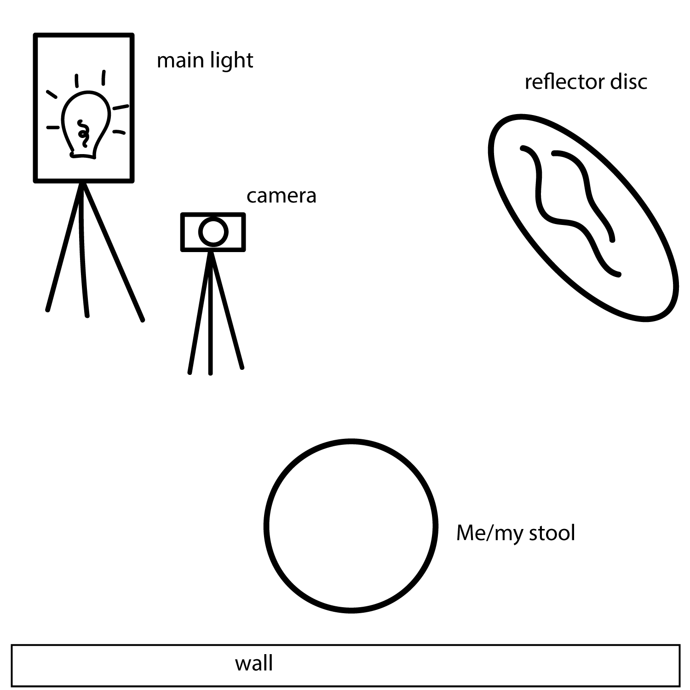

Inspired by the photographer Marina Williams, I decided to take some new self-portraits to use as my default photo for my accounts. I'm actually really happy with the one I currently use, but it's 2 years old and I just wanted something fresh. Marina Williams is a really popular photographer not only because of her amazing pictures and editing style but because of how she's been able to connect with people through social media by sharing what she knows. Marina actually has a free guide available for download specifically for those looking to learn how to take self-portraits (You can download it by signing up for her [**mailing list**](https://www.marinawilliamseducation.com/learn)). I opted out of using it for this photoshoot because I wanted to go through the trial and error myself, but I will definitely use it next time.

My only plan for this shoot was to have new usable selfies for social media, so I didn't do much prep in terms of creative props or lighting. Actually, the prep that took the longest was trying to find the memory card for my camera. It seems like a great idea to have an extra memory card just in case (_Edit: I have since bought an extra memory card_).

A lot of the walls in my house are this lavender, purple color and I didn't want anything too distracting so I chose to pose in front of the only white wall available to me. I took down my beloved macrame art and set up a stool in front of the wall. I set up a photography lamp at a 45 degree angle about 2.5 feet from the stool. I set up my tripod to the left of the lamp. I placed my light reflector disc opposite the lamp, also at a 45 degree angle.

<figure>

<figcaption>

_A very rough diagram of my photoshoot setup. Not to scale._

</figcaption>

</figure>

To start, I had my daughter sit on the stool to test my lighting and settings. The lens I used was my Nikon AF-S Nikkor 50mm f/1.8G lens. The photos were coming out really dark at first, and I couldn't understand why. I thought my camera was broken. After finagling with the settings, I got to a sweet spot with \[camera settings here\]. I got some reaaaaally cute amazing pictures of her, and she enjoyed being the model. When it was my turn, I set up my camera with my iPad to use the remote photography feature on the Nikon App. My camera was connected to my iPad through wifi and I was able to see a live view of my shot, while sitting on the stool away from the camera. I absolutely LOVE this feature, my only complaint is that there is a delay, especially if I want to immediately download the photos to the iPad.

Actually taking the pictures was a little bit harder than I thought - timing was more important than anything. At first, I just pressed the button and I just looked at the camera and smiled in a way that I thought was cute, but this resulted in more of an awkward and frozen expression. As I got over the awkwardness (yes, you can feel awkward taking your own photos), I got pictures that I was more happy with. The best feature, other than the remote photography part, was the self-timer button. This allowed me to change the shutter speed so that I could capture more movement and therefore more natural photos. Other things that helped were "catching the light" and having my daughter around as a hype man. Another issue that I had was my photos being cropped weird. I don't have a full-frame camera, so in order to get a decent photo without part of my head being cut off I have to place the stool and the camera at an optimal distance and make sure that the camera is tilted at a proper angle. Too far from the camera and my shot was blurry, too close and I didn't have a forehead.  

Next time I do this, I want to try to get a little more creative for more interesting photos. I'm thinking fractals or electric blue eyeshadow. I would like try funky clothing, interesting props, or a colorful background.
