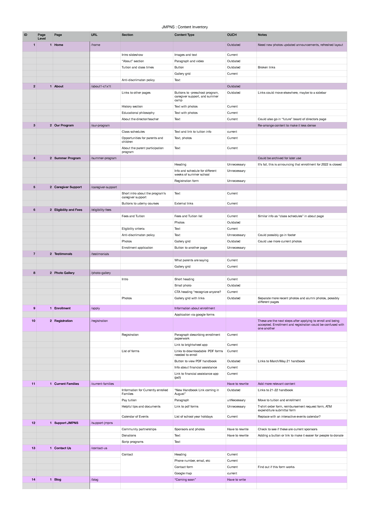
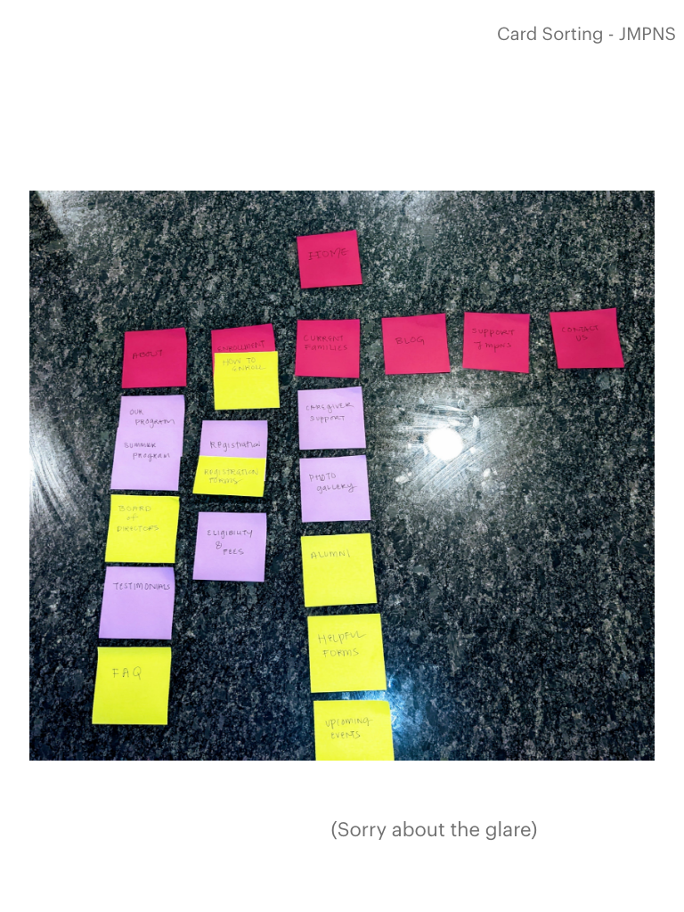

## Content Inventory

<figure>

<figcaption>

Content Inventory chart created in Numbers

</figcaption>

</figure>

## Card Sort

<figure>

<figcaption>

Sticky notes are really good for this sort of thing.

</figcaption>

</figure>

## Site Map

<figure>

<figcaption>

Finally- a nice, clean, and organized page.

</figcaption>

</figure>
