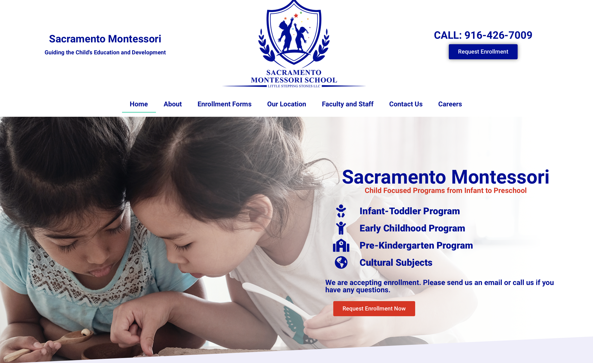
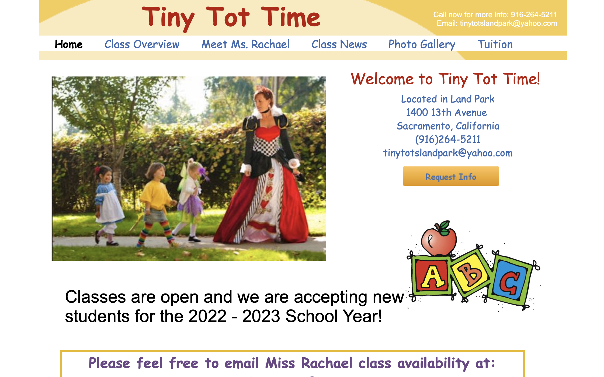
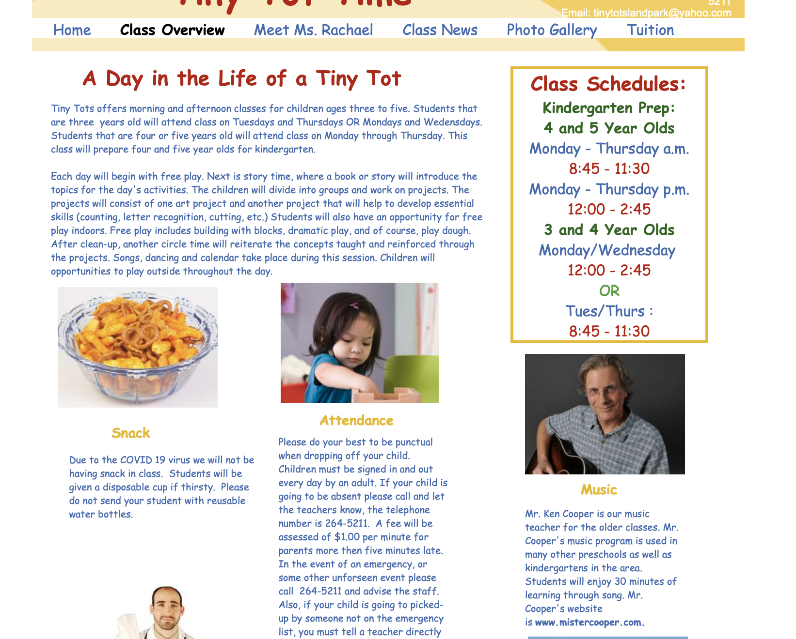

## Woodland Parent Nursery School

[https://woodlandparentnurseryschool.org](https://woodlandparentnurseryschool.org)

My first thought was wow, I love their logo and I love their font choice and I love how the website looks. Their website definitely has a cleaner and more modern feel than the current JMPNS site. Their cover/ header is a clear call-to-action to "Join our Co-op".  
However, while exploring and checking out some of their other pages, it's not that much better than the JMPNS site. Some of the text, like in the "Thoughts from the Teacher" page can be broken up more or set up in a blog page. The "Apply now" button opens up a new tab to downloadable PDF files. The "Learn More" button next to the navigation is redundant because it leads to the same enrollment page. Overall, I really like the look and feel of their site but they could use a better IA or more planning for the content.

## Sacramento Montessori School

[https://www.montessorisacramento.com](https://www.montessorisacramento.com)

The look and feel is giving me corporate vibes but their information is all really well-organized and easy to page through. I do wish that there wasn't so much scrolling to do on the main page just to get to the bottom. I like that they included detailed information about each of their programs, including information about toilet-training. I think that their product might be better but that red "Request Enrollment Now" button might be a bit of an overkill.

## TINY TOT TIME

[http://www.landparktinytots.com](http://www.landparktinytots.com)

Why does that Comic Sans looking font have to BE everywhere? JMPNS is using a similar one called Patrick Hand, and on one hand - I get it. On the other one, I want to do more research and see if there's an alternative that is also friendly, playful, and easily-readable.  
I appreciate that there are **less** pages to look through and there doesn't seem to be any filler text or content. Everything is short and to the point. The "Class Overview" page does need a sort of revamp with less columns or maybe a tiled gallery or slideshow for those little bits of information (see the image below).

