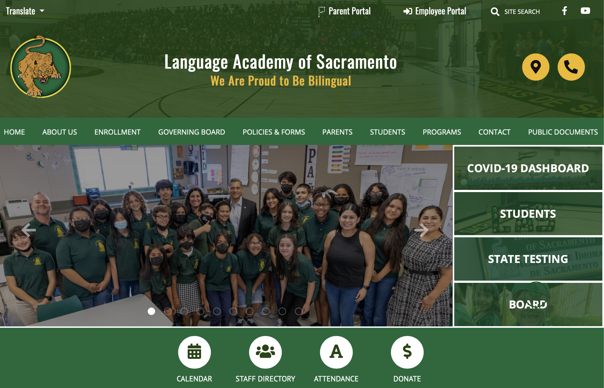
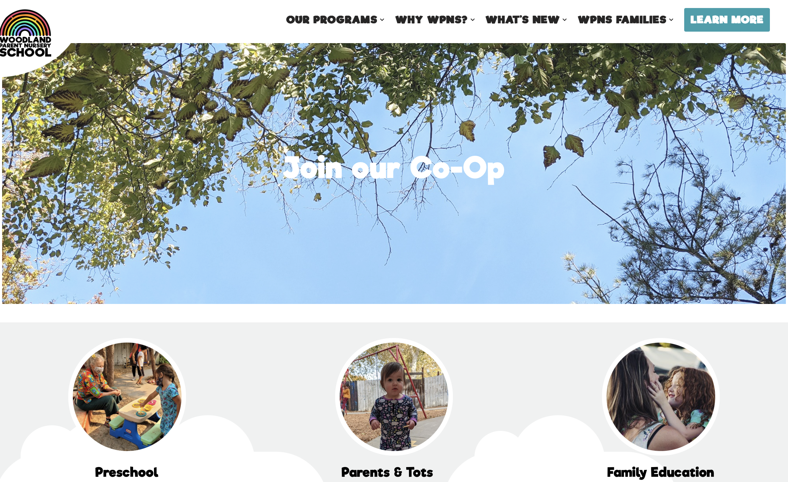

## Buddhist Church of Sacramento

[https://www.buddhistchurch.org](https://www.buddhistchurch.org)

Pretty responsive and they have a lot of information that's organized well in a small size. The more important links - or the ones that they want us to see first - are in purple and as we scroll down we see other links to other sections of the site.  
I don't know what's up with that little picture at the corner though.

## Language Academy of Sacramento

[https://www.lasac.info](https://www.lasac.info)

The Language Academy is a charter school part of the Sacramento Unified School District and they have a lot more going on in terms of content and pages. I find it easier to navigate than other sites with less content and perhaps it's because most of the information that I'm looking for is more intuitive. Or perhaps it's because the most visited links might be front-and-center, right in the nav bar.

## Woodland Parent Nursery School

[https://woodlandparentnurseryschool.org](https://woodlandparentnurseryschool.org)

Although I placed this site in the competitors section and even critiqued them for a few things, I really feel like I could take some of the things that they did and apply it to the JMPNS site.  
Their site overall seems less cluttered but has a soothing effect, maybe it's the gray tones? Or the cute cloud shapes sprinkled throughout? The navigation also seems clear. I also like how they titled some of their pages, like "Meet the Teachers" and "Meet the Board". The copy seems more friendly and less intimidating as opposed to going with "About The Board of Directors".
