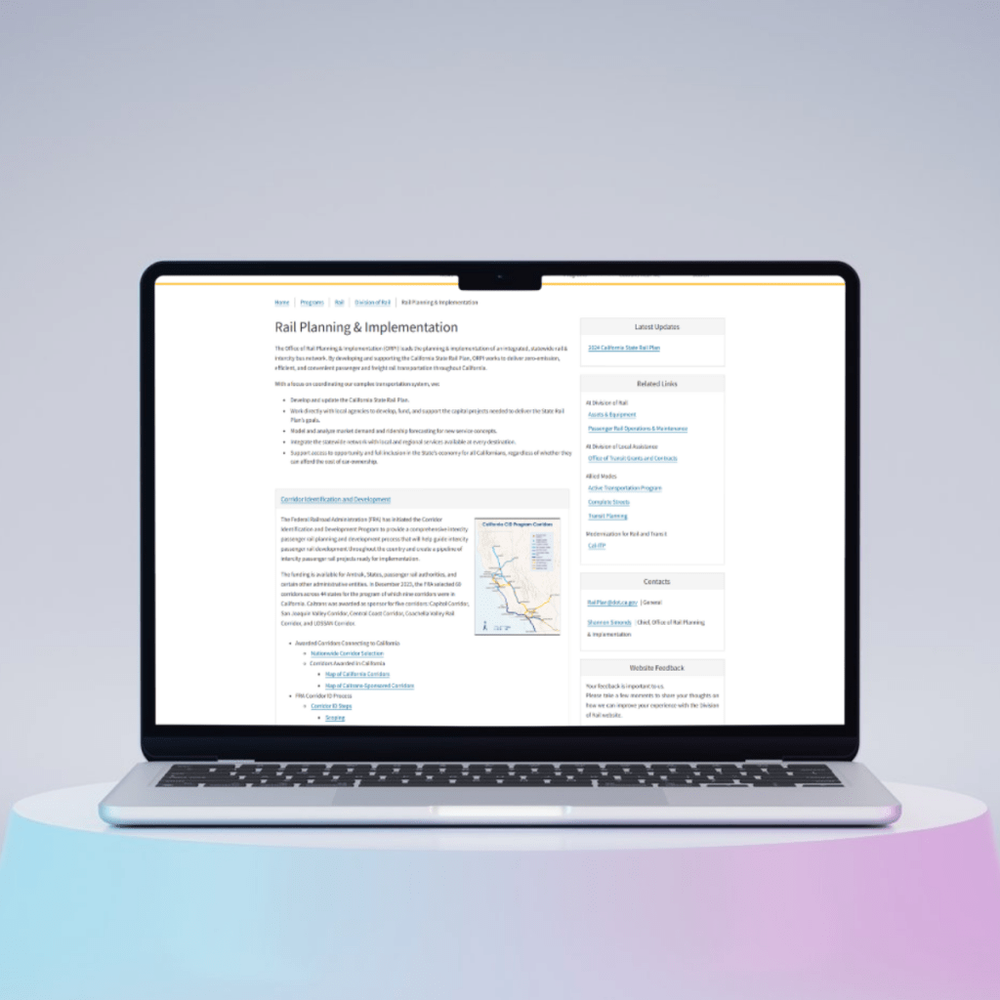

## CALTRANS WEBPAGE REDESIGN

* * *

### OVERVIEW

The Division of Rail pages needed a full refresh and several new pages to improve clarity and usability. I led this project from start to finish – coordinating with stakeholders, organizing content, and building components in HTML/CSS – making it easier for users to find what they needed.

* * *

PROJECT TYPE: WEB DESIGN - SITECORE • USER EXPERIENCE • USER INTERFACE

### My Role

- Managed the project day-to-day, keeping multiple teams aligned.

- Collected, organized, and structured content to meet deadlines

- Built and customized components for consistency and scalability

- Focused on clear, user-friendly design and accessibility

### **Challenges**

Some pages were brand new, others needed a refresh. My approach:

- Launched pages with clear navigation and structure

- Audited content and identified gaps

- Partnered with stakeholders to gather accurate info

- Built reusable components in Sitecore

## RESULTS

- Delivered new pages and refreshed existing ones

- Improved navigation, clarity, and accessibility

- Positive feedback from stakeholders and users

[VISIT WEBSITE](https://dot.ca.gov/programs/rail/about-rail)

## TAKEAWAYS

This project strengthened my skills in leading digital projects, building components, and creating user-focused experiences. Collaborating with my manager and stakeholders reinforced the importance of teamwork while still owning the project from start to finish.

