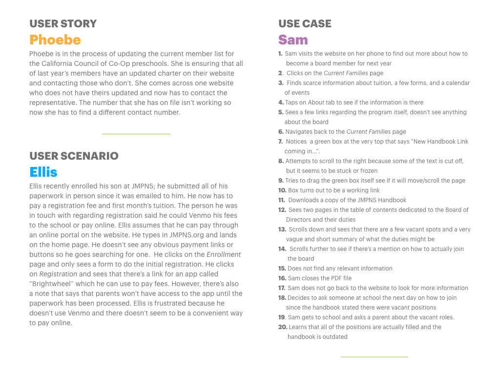
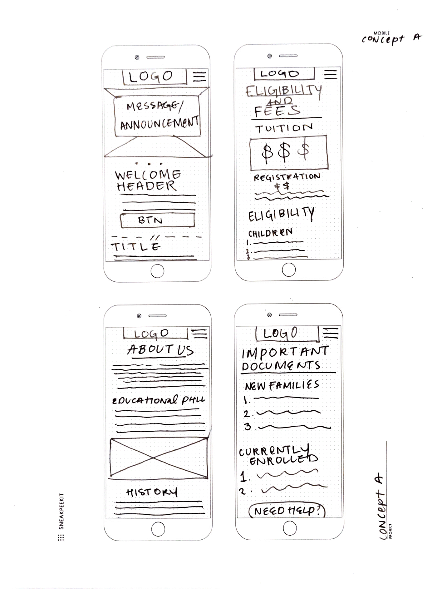
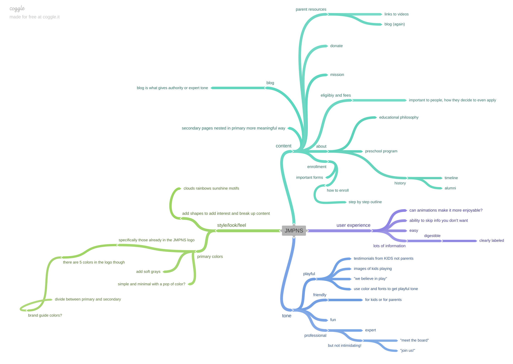
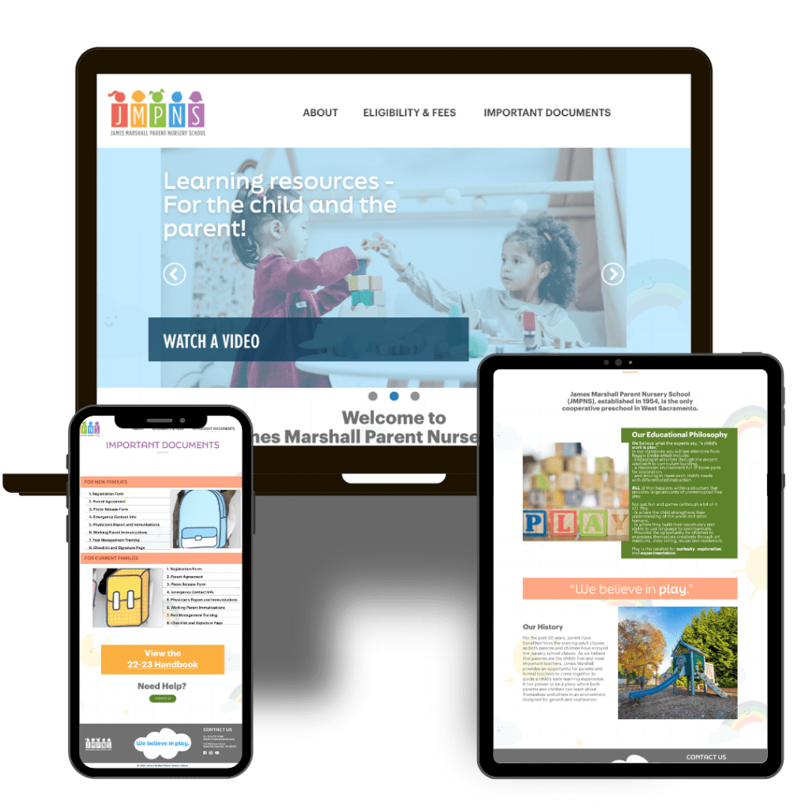
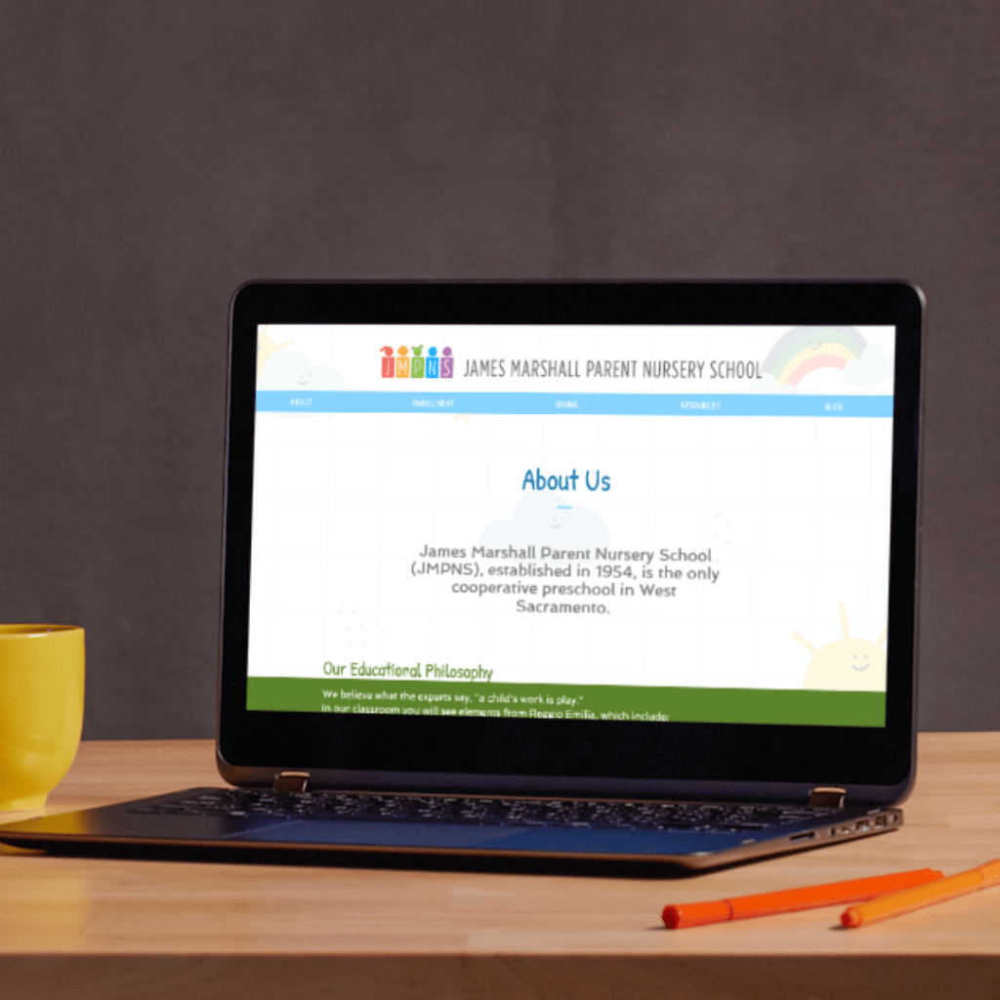

## JMPNS WEBSITE REDESIGN

* * *

## OVERVIEW

**How can i make this site more user friendly and visually-appealing?**

* * *

**PROJECT TYPE: RESPONSIVE WEBSITE - WIX CMS** **• USER EXPERIENCE • USER INTERFACE**

### Design From the Inside Out

With meticulous attention to detail and a commitment to making something better, I created an easy-to-use, bright, and colorful site that represented what JMPNS is all about -
the kids and their parents. Redesigning the website was a UX transformation that enhanced the navigation, infrastructure, and accessibility of the JMPNS site.

### User Experience Strategy

I started the process by studying the websites of [competitors](http://yessikenney.com/jmpns-competitors/) and [role models](http://yessikenney.com/jmpns-role-models/). This helped me get an idea of what a successful preschool website would look like.  

### Tools + Techniques

Brainstorming tools, like [Coggle](https://coggle.it/?lang=en-US), and UX research techniques like a content inventory, card sorting, and persona studies were invaluable in trying to get the perspective from a user and figuring out what was working and what wasn't. Additionally, dissecting the information architecture was the essential to build a good foundation for the rest of the content.

Mockup for User Experience Research by Yessi Kenney

## THE PROBLEM

The website was cluttered, used a lot of clashing colors, and it was hard to find information. If you want to get a glimpse of what it looked like before, check out the [JMPNS Wayback](https://web.archive.org/web/20220205172122/https://www.jmpns.org/) archive page. Some of the things we wanted to execute:

1. Make the site more mobile-friendly

2. Update the look and content

[VISIT WEBSITE](https://www.jmpns.org/)

## THE PROCESS

I've never thought of myself as a storyteller, but in order to make this an actual UX transformation rather than just a coding project, I needed to put myself in the user's shoes and empathize with them, and basically come up with stories for the made-up people, I mean personas. I also had to think through and find out who was using the website, other than the parents, so I interviewed the director to see if I could any insight on that.

For the best outcome, a designer should be able to think about who will be using the product and _how_.

## THE SOLUTION

In a lot of instances, the final product turned out just like I imagined it. In others, it's totally different and for the better. In many ways, I would do it all over again. It's a lot easier to find information as a parent, potential parent, or random government worker. The look is also a lot cleaner than it was before. If I were to work on this again, today, I would continue fine-tuning the visual elements - making sure there are no tense tight spaces- pay more attention to how the content and layout work together, and keep tweaking to meet accessibility standards.

