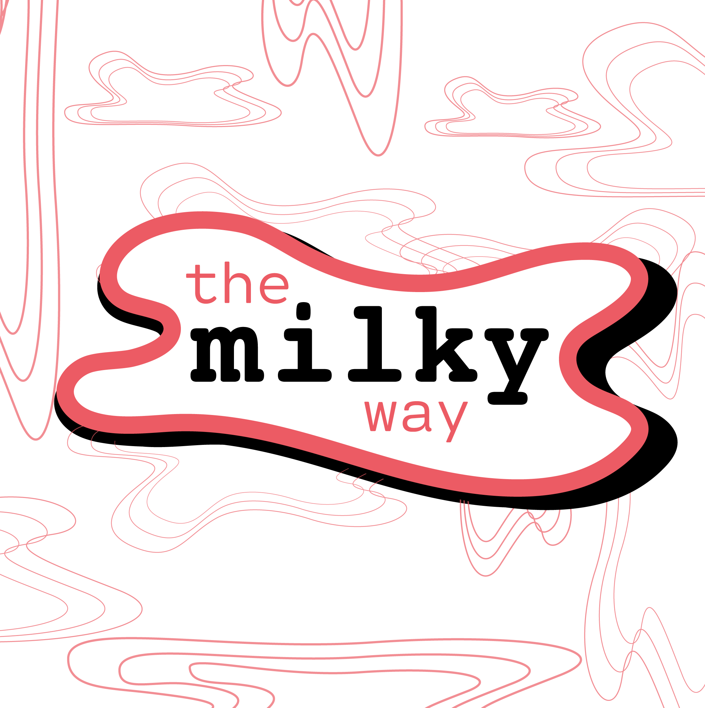
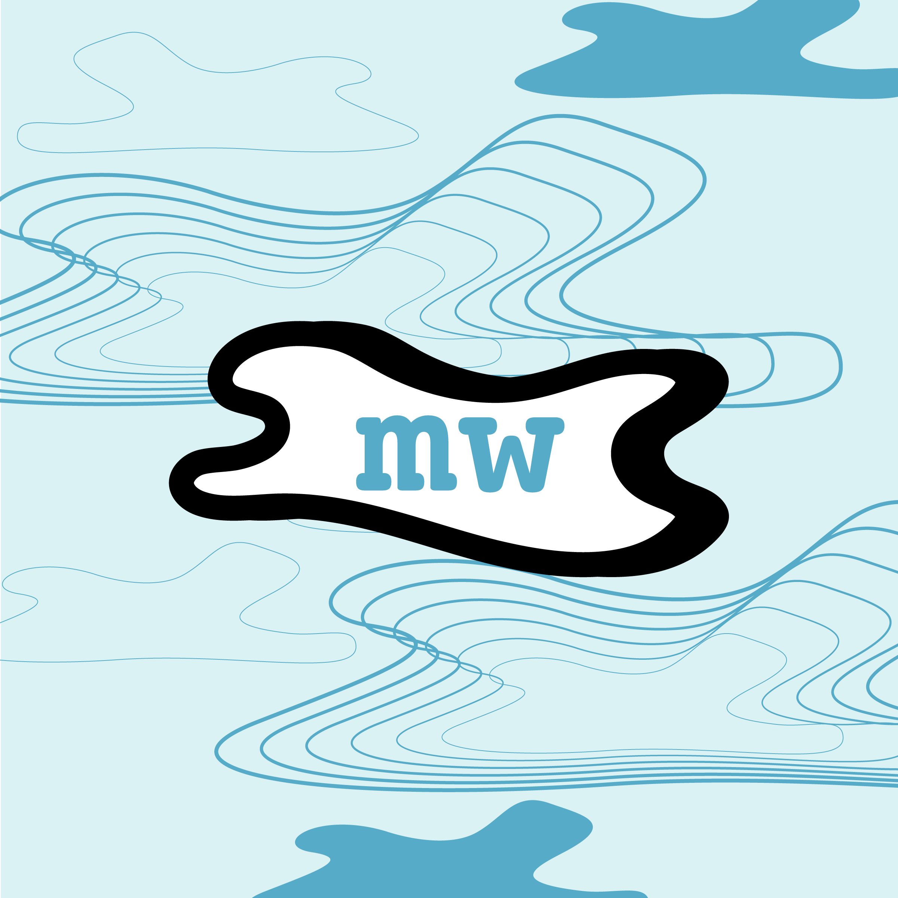

## BRANDING: MILKY WAY

### Project Type: Branding • Logo Design

Brief Branding Challenge proposed by The Brief Collective. The brief called for a logo, secondary logo, some patterns, and additional collateral for a fictional restaurant called "The Milky Way". I enjoy creating bold, colorful, and _wavy_ designs so this was a good way to let some of that out.

### Process

To do this I used Adobe Illustrator to create an initial mark, decide on a color palette that reminded me of bubble-gum ice cream, and went to town putting together patterns and type on various art boards. Mockups were downloaded from Freepik and tested in Photoshop to see what the design might look like in a real-life scenario. It is important to consider all angles and views.

