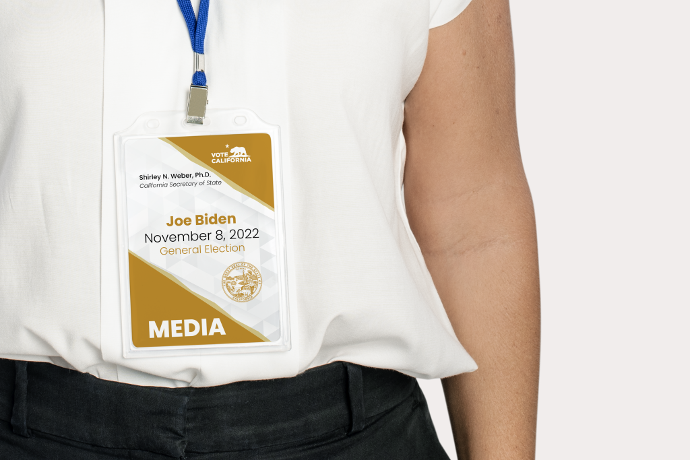
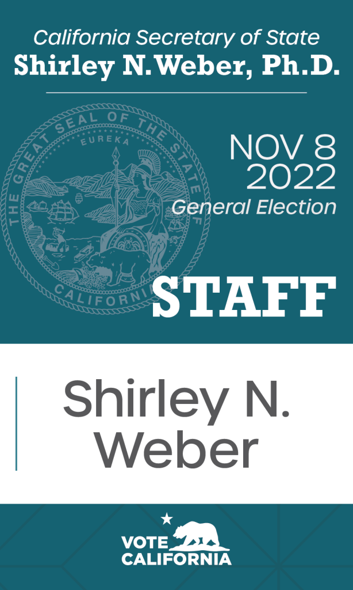

## S.O.S. STAFF BADGES

* * *

 The Ask

### Work Creatively within Brand Guidelines

* * *

#### PROJECT TYPE: GRAPHIC DESIGN • BRAND DESIGN • CIVIC DESIGN

During my time at the Secretary of State, I worked with a small team to design covers for the local Voter Guide, created ad-hoc marketing materials, and translated and re-created departmental forms in different languages. This project, designing the staff badges for the General Election, was one of the more fun projects.  
The stakeholder wanted 3 different options to choose from, and there were 3 different badges needed (for Guests, Staff, and Media), so there was a lot of sketching involved.

It was really important to keep these from getting too wild, as this was still a government entity I was designing for, so we were going for a clean and modern look with the brand guidelines.  
In total, I created 9 different badges and 4 parking passes with interesting, yet not-too-crazy colors, and and cute patterns that would be fun to wear but not too distracting.  
It was truly a balancing act.

