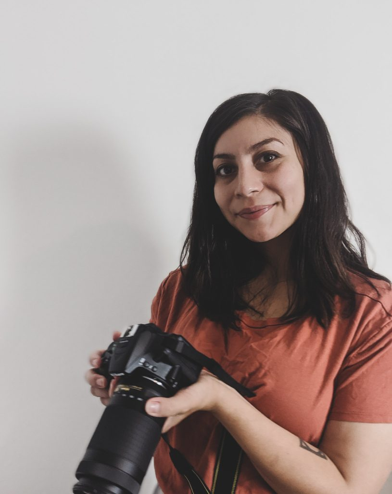

Turning _your_ ideas into sleek, functional realities

# About

I'm Yessi and I help small businesses, nonprofits, and government agencies build digital spaces that look good, work good and smell good. Just kidding, but they're definitely well-made and functional. Your website should be intuitive, accessible, and built with purpose — I'm here to help you with that. I'll also make sure that your site represents you and helps you reach your goals.

With a work history in market / public health research and a passion for art, web development, and accessibility – I aim to continue helping people by designing intuitive and impactful websites.

**More Fun Facts:**

• I speak español.

• I have 2 cute cats.

• I play Sudoku every night.

**Current Motto:**

_Purpose is connection._  

